# 🗄️ DOKUMENTASI SKEMA DATABASE TAMBAHAN (FASTAPI & POSTGRESQL/MYSQL)

Dokumen ini berisi spesifikasi skema tabel database tambahan, relasi antar-entitas (ERD), tipe data, dan daftar endpoint API yang diperlukan untuk melengkapi sistem **EduSphere SIAKAD & LMS**.

Skema ini dirancang selaras dengan konvensi pada `API_DOCUMENTATION.md` (**UUID v4**, Relational Integrity, Timestamp ISO UTC, dan RBAC).

---

## 📑 DAFTAR ISI
1. [Diagram Entitas Relasi (ERD) Lengkap](#1-diagram-entitas-relasi-erd-lengkap)
2. [Detail Tabel Modul LMS (Learning Management System)](#2-detail-tabel-modul-lms)
   - `materials` (Materi Belajar)
   - `student_material_progress` (Progres Penyelesaian Materi)
   - `assignments` (Tugas Siswa)
   - `submissions` (Pengumpulan Tugas Siswa)
   - `submission_histories` (Audit Trail Revisi Tugas)
   - `grades` (Penilaian Tugas)
   - `portfolios` (Portofolio Siswa)
3. [Detail Tabel Modul Akademik & Rapor](#3-detail-tabel-modul-akademik--rapor)
   - `report_cards` (Rapor Semester Siswa)
   - `report_card_items` (Nilai Capaian per Mapel)
4. [Detail Tabel Modul Presensi & Absensi](#4-detail-tabel-modul-presensi--absensi)
   - `attendance_sessions` (Sesi Presensi Kelas/Mapel)
   - `attendance_records` (Catatan Kehadiran Siswa)
5. [Detail Tabel Modul Pengumuman & Media](#5-detail-tabel-modul-pengumuman--media)
   - `announcements` (Pengumuman Sekolah & Kelas)
   - `media_files` (Manajemen Berkas Unggahan)
6. [Detail Tabel Audit & Sistem](#6-detail-tabel-audit--sistem)
   - `activity_logs` (Catatan Aktivitas Sistem)
   - `system_settings` (Konfigurasi Dinamis Aplikasi)
7. [Daftar Endpoint API Tambahan](#7-daftar-endpoint-api-tambahan)

---

## 1. DIAGRAM ENTITAS RELASI (ERD) LENGKAP

Berikut diagram relasi antara tabel yang sudah ada di `API_DOCUMENTATION.md` (warna abu/dasar) dengan tabel-tabel baru (LMS, Rapor, Presensi, Pengumuman):

```mermaid
erDiagram
    %% Tabel Existing di SIAKAD Master
    USERS ||--o{ EMPLOYEES : "has profile"
    USERS ||--o{ STUDENTS : "has profile"
    SCHOOLS ||--o{ CLASSROOMS : "contains"
    CLASSROOMS ||--o{ ENROLLMENTS : "enrolled in"
    STUDENTS ||--o{ ENROLLMENTS : "has"
    ACADEMIC_YEARS ||--o{ ENROLLMENTS : "for"
    SEMESTERS ||--o{ ENROLLMENTS : "for"
    SUBJECTS ||--o{ TEACHING_SCHEDULES : "scheduled in"
    CLASSROOMS ||--o{ TEACHING_SCHEDULES : "placed in"
    EMPLOYEES ||--o{ TEACHING_SCHEDULES : "taught by"

    %% Modul LMS: Materials & Progress
    SUBJECTS ||--o{ MATERIALS : "contains"
    EMPLOYEES ||--o{ MATERIALS : "created by"
    MATERIALS ||--o{ STUDENT_MATERIAL_PROGRESS : "tracked by"
    STUDENTS ||--o{ STUDENT_MATERIAL_PROGRESS : "completes"

    %% Modul LMS: Assignments & Submissions
    SUBJECTS ||--o{ ASSIGNMENTS : "has"
    EMPLOYEES ||--o{ ASSIGNMENTS : "created by"
    CLASSROOMS ||--o{ ASSIGNMENTS : "assigned to"
    ASSIGNMENTS ||--o{ SUBMISSIONS : "receives"
    STUDENTS ||--o{ SUBMISSIONS : "submits"
    SUBMISSIONS ||--o{ SUBMISSION_HISTORIES : "tracks"
    SUBMISSIONS ||--o| GRADES : "evaluated in"
    EMPLOYEES ||--o{ GRADES : "graded by"

    %% Modul Portofolio
    STUDENTS ||--o{ PORTFOLIOS : "owns"
    SUBMISSIONS ||--o| PORTFOLIOS : "referenced from"

    %% Modul Akademik & Rapor
    STUDENTS ||--o{ REPORT_CARDS : "receives"
    CLASSROOMS ||--o{ REPORT_CARDS : "belongs to"
    ACADEMIC_YEARS ||--o{ REPORT_CARDS : "for year"
    SEMESTERS ||--o{ REPORT_CARDS : "for semester"
    EMPLOYEES ||--o{ REPORT_CARDS : "signed by homeroom"
    REPORT_CARDS ||--o{ REPORT_CARD_ITEMS : "has detail"
    SUBJECTS ||--o{ REPORT_CARD_ITEMS : "scores for"

    %% Modul Presensi
    CLASSROOMS ||--o{ ATTENDANCE_SESSIONS : "holds"
    SUBJECTS ||--o{ ATTENDANCE_SESSIONS : "for subject"
    EMPLOYEES ||--o{ ATTENDANCE_SESSIONS : "taken by"
    ATTENDANCE_SESSIONS ||--o{ ATTENDANCE_RECORDS : "contains"
    STUDENTS ||--o{ ATTENDANCE_RECORDS : "records for"

    %% Modul Pengumuman & Media
    USERS ||--o{ ANNOUNCEMENTS : "published by"
    CLASSROOMS ||--o{ ANNOUNCEMENTS : "targeted to"
    USERS ||--o{ MEDIA_FILES : "uploaded by"
    USERS ||--o{ ACTIVITY_LOGS : "performed by"

    %% Detail Definisi Tabel Tambahan
    MATERIALS {
        uuid id PK
        uuid subject_id FK
        uuid employee_id FK
        string title
        text content
        string file_path
        string video_url
        boolean is_active
        timestamp created_at
        timestamp updated_at
    }

    STUDENT_MATERIAL_PROGRESS {
        uuid id PK
        uuid student_id FK
        uuid material_id FK
        timestamp completed_at
    }

    ASSIGNMENTS {
        uuid id PK
        uuid subject_id FK
        uuid classroom_id FK
        uuid employee_id FK
        string title
        text description
        string type "essay | file | quiz | coding | project"
        string file_path
        timestamp deadline
        decimal max_score
        boolean is_active
        timestamp created_at
        timestamp updated_at
    }

    SUBMISSIONS {
        uuid id PK
        uuid assignment_id FK
        uuid student_id FK
        text content
        string file_path
        string status "draft | submitted | need_revision | graded"
        timestamp submitted_at
        timestamp created_at
        timestamp updated_at
    }

    GRADES {
        uuid id PK
        uuid submission_id FK,UK
        uuid graded_by FK
        decimal score
        text feedback
        timestamp created_at
        timestamp updated_at
    }

    REPORT_CARDS {
        uuid id PK
        uuid student_id FK
        uuid classroom_id FK
        uuid academic_year_id FK
        uuid semester_id FK
        uuid homeroom_teacher_id FK
        integer sick_count
        integer permitted_count
        integer unexcused_count
        text homeroom_notes
        string status "draft | published"
        timestamp created_at
        timestamp updated_at
    }

    REPORT_CARD_ITEMS {
        uuid id PK
        uuid report_card_id FK
        uuid subject_id FK
        decimal knowledge_score
        decimal skill_score
        decimal final_score
        string letter_grade "A | B | C | D"
        text competency_description
    }

    ATTENDANCE_SESSIONS {
        uuid id PK
        uuid classroom_id FK
        uuid subject_id FK
        uuid employee_id FK
        uuid academic_year_id FK
        uuid semester_id FK
        date session_date
        time start_time
        time end_time
        string topic
        timestamp created_at
    }

    ATTENDANCE_RECORDS {
        uuid id PK
        uuid session_id FK
        uuid student_id FK
        string status "present | sick | permit | absent"
        text remarks
        timestamp recorded_at
    }
```

---

## 2. DETAIL TABEL MODUL LMS

### 2.1 Tabel `materials` (Materi Pelajaran)
Menyimpan konten materi pembelajaran yang diunggah oleh guru mata pelajaran.

| Kolom | Tipe Data | Constraint | Deskripsi |
|---|---|---|---|
| `id` | `UUID` | `PRIMARY KEY` | Unique ID materi (UUID v4) |
| `subject_id` | `UUID` | `FOREIGN KEY` &rarr; `subjects(id)` `ON DELETE CASCADE` | Mata pelajaran terkait |
| `employee_id` | `UUID` | `FOREIGN KEY` &rarr; `employees(id)` `ON DELETE SET NULL`, `NULLABLE` | Guru pembuat materi |
| `title` | `VARCHAR(255)` | `NOT NULL` | Judul materi pembelajaran |
| `content` | `LONGTEXT` | `NULLABLE` | Isi artikel / teks penjelasan / catatan HTML/Markdown |
| `file_path` | `VARCHAR(500)` | `NULLABLE` | Path file lampiran (PDF, PPT, DOCX, ZIP) |
| `video_url` | `VARCHAR(500)` | `NULLABLE` | Link video pembelajaran (YouTube/Vimeo/Direct) |
| `is_active` | `BOOLEAN` | `DEFAULT TRUE` | Status publish materi |
| `created_at` | `TIMESTAMP WITH TIME ZONE` | `DEFAULT CURRENT_TIMESTAMP` | Waktu dibuat |
| `updated_at` | `TIMESTAMP WITH TIME ZONE` | `DEFAULT CURRENT_TIMESTAMP` | Waktu diupdate |

---

### 2.2 Tabel `student_material_progress` (Progres Materi Siswa)
Tabel pivot untuk mencatat materi apa saja yang sudah diselesaikan/dibaca oleh siswa. Digunakan untuk menghitung *Progress Bar* dan *Learning Streak*.

| Kolom | Tipe Data | Constraint | Deskripsi |
|---|---|---|---|
| `id` | `UUID` | `PRIMARY KEY` | ID Progress (UUID v4) |
| `student_id` | `UUID` | `FOREIGN KEY` &rarr; `students(id)` `ON DELETE CASCADE` | Siswa yang menyelesaikan materi |
| `material_id` | `UUID` | `FOREIGN KEY` &rarr; `materials(id)` `ON DELETE CASCADE` | Materi yang diselesaikan |
| `completed_at` | `TIMESTAMP WITH TIME ZONE` | `DEFAULT CURRENT_TIMESTAMP` | Waktu penyelesaian |

*Index & Unique Constraint*: `UNIQUE(student_id, material_id)` agar tidak terjadi duplikasi progres.

---

### 2.3 Tabel `assignments` (Tugas Siswa)
Menyimpan data penugasan yang diberikan guru kepada siswa di kelas tertentu.

| Kolom | Tipe Data | Constraint | Deskripsi |
|---|---|---|---|
| `id` | `UUID` | `PRIMARY KEY` | ID Tugas (UUID v4) |
| `subject_id` | `UUID` | `FOREIGN KEY` &rarr; `subjects(id)` `ON DELETE CASCADE` | Mata pelajaran |
| `classroom_id` | `UUID` | `FOREIGN KEY` &rarr; `classrooms(id)` `ON DELETE CASCADE` | Ruang kelas target |
| `employee_id` | `UUID` | `FOREIGN KEY` &rarr; `employees(id)` `ON DELETE SET NULL`, `NULLABLE` | Guru pembuat tugas |
| `title` | `VARCHAR(255)` | `NOT NULL` | Judul tugas |
| `description` | `LONGTEXT` | `NOT NULL` | Deskripsi / petunjuk pengerjaan tugas |
| `type` | `VARCHAR(20)` | `NOT NULL`, `DEFAULT 'file'` | Tipe tugas: `essay`, `file`, `quiz`, `coding`, `project` |
| `file_path` | `VARCHAR(500)` | `NULLABLE` | Berkas soal / lembar kerja panduan |
| `deadline` | `TIMESTAMP WITH TIME ZONE` | `NOT NULL` | Batas akhir pengumpulan (Tanggal & Jam) |
| `max_score` | `DECIMAL(5,2)` | `DEFAULT 100.00` | Bobot skor maksimal |
| `is_active` | `BOOLEAN` | `DEFAULT TRUE` | Status aktif penugasan |
| `created_at` | `TIMESTAMP WITH TIME ZONE` | `DEFAULT CURRENT_TIMESTAMP` | Waktu dibuat |
| `updated_at` | `TIMESTAMP WITH TIME ZONE` | `DEFAULT CURRENT_TIMESTAMP` | Waktu diupdate |

---

### 2.4 Tabel `submissions` (Pengumpulan Tugas)
Menyimpan berkas atau teks jawaban yang dikirimkan oleh siswa untuk tugas tertentu.

| Kolom | Tipe Data | Constraint | Deskripsi |
|---|---|---|---|
| `id` | `UUID` | `PRIMARY KEY` | ID Pengumpulan (UUID v4) |
| `assignment_id` | `UUID` | `FOREIGN KEY` &rarr; `assignments(id)` `ON DELETE CASCADE` | Tugas yang dikerjakan |
| `student_id` | `UUID` | `FOREIGN KEY` &rarr; `students(id)` `ON DELETE CASCADE` | Siswa yang mengumpulkan |
| `content` | `LONGTEXT` | `NULLABLE` | Jawaban berupa teks / uraian essay / link repositori |
| `file_path` | `VARCHAR(500)` | `NULLABLE` | Berkas jawaban siswa (PDF/ZIP/gambar) |
| `status` | `VARCHAR(30)` | `DEFAULT 'submitted'` | Enum: `draft`, `submitted`, `need_revision`, `graded` |
| `submitted_at` | `TIMESTAMP WITH TIME ZONE` | `DEFAULT CURRENT_TIMESTAMP` | Waktu pengumpulan |
| `created_at` | `TIMESTAMP WITH TIME ZONE` | `DEFAULT CURRENT_TIMESTAMP` | Waktu dibuat |
| `updated_at` | `TIMESTAMP WITH TIME ZONE` | `DEFAULT CURRENT_TIMESTAMP` | Waktu update terakhir |

*Index & Unique Constraint*: `UNIQUE(assignment_id, student_id)`.

---

### 2.5 Tabel `submission_histories` (Audit Log / Revisi Pengumpulan)
Mencatat riwayat setiap kali siswa submit ulang atau guru meminta revisi.

| Kolom | Tipe Data | Constraint | Deskripsi |
|---|---|---|---|
| `id` | `UUID` | `PRIMARY KEY` | ID History (UUID v4) |
| `submission_id` | `UUID` | `FOREIGN KEY` &rarr; `submissions(id)` `ON DELETE CASCADE` | Submission target |
| `status` | `VARCHAR(30)` | `NOT NULL` | Status saat perubahan terjadi |
| `content` | `LONGTEXT` | `NULLABLE` | Snapshot jawaban teks |
| `file_path` | `VARCHAR(500)` | `NULLABLE` | Snapshot file berkas |
| `comment` | `TEXT` | `NULLABLE` | Catatan revisi atau pesan |
| `changed_by` | `UUID` | `FOREIGN KEY` &rarr; `users(id)` `ON DELETE SET NULL`, `NULLABLE` | User yang melakukan aksi |
| `created_at` | `TIMESTAMP WITH TIME ZONE` | `DEFAULT CURRENT_TIMESTAMP` | Waktu revisi |

---

### 2.6 Tabel `grades` (Penilaian Tugas Siswa)
Menyimpan skor nilai dan ulasan guru atas tugas yang dikumpulkan siswa.

| Kolom | Tipe Data | Constraint | Deskripsi |
|---|---|---|---|
| `id` | `UUID` | `PRIMARY KEY` | ID Penilaian (UUID v4) |
| `submission_id` | `UUID` | `FOREIGN KEY` &rarr; `submissions(id)` `ON DELETE CASCADE`, `UNIQUE` | 1 Submission memiliki 1 Nilai Final |
| `graded_by` | `UUID` | `FOREIGN KEY` &rarr; `employees(id)` `ON DELETE SET NULL`, `NULLABLE` | Guru penilai |
| `score` | `DECIMAL(5,2)` | `NOT NULL` | Nilai angka perolehan (contoh: `85.50`) |
| `feedback` | `TEXT` | `NULLABLE` | Ulasan / komentar dari guru |
| `created_at` | `TIMESTAMP WITH TIME ZONE` | `DEFAULT CURRENT_TIMESTAMP` | Waktu dinilai |
| `updated_at` | `TIMESTAMP WITH TIME ZONE` | `DEFAULT CURRENT_TIMESTAMP` | Waktu diperbarui |

---

### 2.7 Tabel `portfolios` (Portofolio Karya Siswa)
Menyimpan portofolio karya atau tugas terbaik siswa untuk ditampilkan ke publik atau guru/wali.

| Kolom | Tipe Data | Constraint | Deskripsi |
|---|---|---|---|
| `id` | `UUID` | `PRIMARY KEY` | ID Portofolio (UUID v4) |
| `student_id` | `UUID` | `FOREIGN KEY` &rarr; `students(id)` `ON DELETE CASCADE` | Pemilik portofolio |
| `submission_id` | `UUID` | `FOREIGN KEY` &rarr; `submissions(id)` `ON DELETE SET NULL`, `NULLABLE` | Tautan ke tugas terkait (opsional) |
| `title` | `VARCHAR(255)` | `NOT NULL` | Judul portofolio |
| `description` | `LONGTEXT` | `NOT NULL` | Deskripsi karya/proyek |
| `file_path` | `VARCHAR(500)` | `NULLABLE` | Berkas / thumbnail karya |
| `status` | `VARCHAR(20)` | `DEFAULT 'draft'` | Status: `draft`, `published` |
| `created_at` | `TIMESTAMP WITH TIME ZONE` | `DEFAULT CURRENT_TIMESTAMP` | Waktu dibuat |
| `updated_at` | `TIMESTAMP WITH TIME ZONE` | `DEFAULT CURRENT_TIMESTAMP` | Waktu diperbarui |

---

## 3. DETAIL TABEL MODUL AKADEMIK & RAPOR

### 3.1 Tabel `report_cards` (Rapor Semester Siswa)
Header rapor siswa yang diterbitkan per semester oleh wali kelas.

| Kolom | Tipe Data | Constraint | Deskripsi |
|---|---|---|---|
| `id` | `UUID` | `PRIMARY KEY` | ID Rapor (UUID v4) |
| `student_id` | `UUID` | `FOREIGN KEY` &rarr; `students(id)` `ON DELETE CASCADE` | Siswa penerima rapor |
| `classroom_id` | `UUID` | `FOREIGN KEY` &rarr; `classrooms(id)` `ON DELETE CASCADE` | Kelas saat rapor diterbitkan |
| `academic_year_id` | `UUID` | `FOREIGN KEY` &rarr; `academic_years(id)` `ON DELETE RESTRICT` | Tahun ajaran |
| `semester_id` | `UUID` | `FOREIGN KEY` &rarr; `semesters(id)` `ON DELETE RESTRICT` | Semester (Ganjil/Genap) |
| `homeroom_teacher_id` | `UUID` | `FOREIGN KEY` &rarr; `employees(id)` `ON DELETE SET NULL`, `NULLABLE` | Guru wali kelas |
| `sick_count` | `INTEGER` | `DEFAULT 0` | Jumlah hari sakit |
| `permitted_count` | `INTEGER` | `DEFAULT 0` | Jumlah hari izin |
| `unexcused_count` | `INTEGER` | `DEFAULT 0` | Jumlah hari tanpa keterangan (Alpa) |
| `homeroom_notes` | `TEXT` | `NULLABLE` | Catatan perkembangan dari wali kelas |
| `status` | `VARCHAR(20)` | `DEFAULT 'draft'` | Status: `draft`, `locked`, `published` |
| `created_at` | `TIMESTAMP WITH TIME ZONE` | `DEFAULT CURRENT_TIMESTAMP` | Waktu dibuat |
| `updated_at` | `TIMESTAMP WITH TIME ZONE` | `DEFAULT CURRENT_TIMESTAMP` | Waktu diupdate |

*Unique Constraint*: `UNIQUE(student_id, academic_year_id, semester_id)` (Satu siswa hanya punya satu rapor per semester).

---

### 3.2 Tabel `report_card_items` (Rincian Nilai per Mata Pelajaran)
Menyimpan rincian nilai capaian per mata pelajaran di dalam rapor.

| Kolom | Tipe Data | Constraint | Deskripsi |
|---|---|---|---|
| `id` | `UUID` | `PRIMARY KEY` | ID Item (UUID v4) |
| `report_card_id` | `UUID` | `FOREIGN KEY` &rarr; `report_cards(id)` `ON DELETE CASCADE` | Header rapor |
| `subject_id` | `UUID` | `FOREIGN KEY` &rarr; `subjects(id)` `ON DELETE RESTRICT` | Mata pelajaran |
| `knowledge_score` | `DECIMAL(5,2)` | `NULLABLE` | Nilai Pengetahuan (Teori) |
| `skill_score` | `DECIMAL(5,2)` | `NULLABLE` | Nilai Keterampilan (Praktik) |
| `final_score` | `DECIMAL(5,2)` | `NOT NULL` | Nilai Akhir Rata-rata |
| `letter_grade` | `VARCHAR(2)` | `NOT NULL` | Predikat: `A`, `B`, `C`, `D` |
| `competency_description` | `TEXT` | `NULLABLE` | Deskripsi capaian kompetensi siswa |

*Unique Constraint*: `UNIQUE(report_card_id, subject_id)`.

---

## 4. DETAIL TABEL MODUL PRESENSI & ABSENSI

### 4.1 Tabel `attendance_sessions` (Sesi Presensi)
Mencatat sesi pertemuan kelas atau jam pelajaran saat presensi dibuka.

| Kolom | Tipe Data | Constraint | Deskripsi |
|---|---|---|---|
| `id` | `UUID` | `PRIMARY KEY` | ID Sesi (UUID v4) |
| `classroom_id` | `UUID` | `FOREIGN KEY` &rarr; `classrooms(id)` `ON DELETE CASCADE` | Ruang kelas |
| `subject_id` | `UUID` | `FOREIGN KEY` &rarr; `subjects(id)` `ON DELETE CASCADE`, `NULLABLE` | Mapel (null jika absensi harian kelas) |
| `employee_id` | `UUID` | `FOREIGN KEY` &rarr; `employees(id)` `ON DELETE SET NULL`, `NULLABLE` | Guru pengambil absensi |
| `academic_year_id` | `UUID` | `FOREIGN KEY` &rarr; `academic_years(id)` `ON DELETE RESTRICT` | Tahun ajaran |
| `semester_id` | `UUID` | `FOREIGN KEY` &rarr; `semesters(id)` `ON DELETE RESTRICT` | Semester |
| `session_date` | `DATE` | `NOT NULL` | Tanggal absensi (`YYYY-MM-DD`) |
| `start_time` | `TIME` | `NULLABLE` | Jam mulai sesi |
| `end_time` | `TIME` | `NULLABLE` | Jam selesai sesi |
| `topic` | `VARCHAR(255)` | `NULLABLE` | Pokok bahasan / materi pertemuan |
| `created_at` | `TIMESTAMP WITH TIME ZONE` | `DEFAULT CURRENT_TIMESTAMP` | Waktu dibuat |

---

### 4.2 Tabel `attendance_records` (Catatan Kehadiran Siswa)
Menyimpan status kehadiran tiap-tiap siswa pada sesi presensi tersebut.

| Kolom | Tipe Data | Constraint | Deskripsi |
|---|---|---|---|
| `id` | `UUID` | `PRIMARY KEY` | ID Record (UUID v4) |
| `session_id` | `UUID` | `FOREIGN KEY` &rarr; `attendance_sessions(id)` `ON DELETE CASCADE` | Sesi presensi |
| `student_id` | `UUID` | `FOREIGN KEY` &rarr; `students(id)` `ON DELETE CASCADE` | Siswa |
| `status` | `VARCHAR(20)` | `NOT NULL` | Status: `present` (Hadir), `sick` (Sakit), `permit` (Izin), `absent` (Alpa) |
| `remarks` | `VARCHAR(255)` | `NULLABLE` | Keterangan tambahan / alasan izin |
| `recorded_at` | `TIMESTAMP WITH TIME ZONE` | `DEFAULT CURRENT_TIMESTAMP` | Waktu pencatatan |

*Unique Constraint*: `UNIQUE(session_id, student_id)`.

---

## 5. DETAIL TABEL MODUL PENGUMUMAN & MEDIA

### 5.1 Tabel `announcements` (Pengumuman Sekolah & Kelas)
Menyimpan broadcast pengumuman baik lingkup seluruh sekolah maupun kelas spesifik.

| Kolom | Tipe Data | Constraint | Deskripsi |
|---|---|---|---|
| `id` | `UUID` | `PRIMARY KEY` | ID Pengumuman (UUID v4) |
| `user_id` | `UUID` | `FOREIGN KEY` &rarr; `users(id)` `ON DELETE SET NULL`, `NULLABLE` | Pembuat pengumuman |
| `classroom_id` | `UUID` | `FOREIGN KEY` &rarr; `classrooms(id)` `ON DELETE CASCADE`, `NULLABLE` | Null jika untuk seluruh sekolah |
| `title` | `VARCHAR(255)` | `NOT NULL` | Judul pengumuman |
| `content` | `LONGTEXT` | `NOT NULL` | Isi lengkap pengumuman |
| `priority` | `VARCHAR(20)` | `DEFAULT 'normal'` | Tingkat urgensi: `low`, `normal`, `high`, `urgent` |
| `target_role` | `VARCHAR(20)` | `NULLABLE` | Filter role: `all`, `teacher`, `student`, `parent` |
| `created_at` | `TIMESTAMP WITH TIME ZONE` | `DEFAULT CURRENT_TIMESTAMP` | Waktu dibuat |
| `updated_at` | `TIMESTAMP WITH TIME ZONE` | `DEFAULT CURRENT_TIMESTAMP` | Waktu diupdate |

---

### 5.2 Tabel `media_files` (Manajemen Berkas Unggahan)
Mencatat riwayat upload berkas di server untuk kemudahan manajemen penyimpanan & sanitasi file.

| Kolom | Tipe Data | Constraint | Deskripsi |
|---|---|---|---|
| `id` | `UUID` | `PRIMARY KEY` | ID Media (UUID v4) |
| `uploaded_by` | `UUID` | `FOREIGN KEY` &rarr; `users(id)` `ON DELETE SET NULL`, `NULLABLE` | Pengunggah berkas |
| `original_name` | `VARCHAR(255)` | `NOT NULL` | Nama asli file |
| `stored_path` | `VARCHAR(500)` | `NOT NULL` | Lokasi path file di server/storage |
| `mime_type` | `VARCHAR(100)` | `NOT NULL` | Tipe MIME (`application/pdf`, `image/png`, dll) |
| `file_size` | `BIGINT` | `NOT NULL` | Ukuran file dalam bytes |
| `category` | `VARCHAR(50)` | `NOT NULL` | Kategori: `avatar`, `material`, `assignment`, `submission`, `document` |
| `created_at` | `TIMESTAMP WITH TIME ZONE` | `DEFAULT CURRENT_TIMESTAMP` | Waktu upload |

---

## 6. DETAIL TABEL AUDIT & SISTEM

### 6.1 Tabel `activity_logs` (Audit Log Pengguna)
Mencatat riwayat aktivitas pengguna untuk audit keamanan data akademik.

| Kolom | Tipe Data | Constraint | Deskripsi |
|---|---|---|---|
| `id` | `UUID` | `PRIMARY KEY` | ID Log (UUID v4) |
| `user_id` | `UUID` | `FOREIGN KEY` &rarr; `users(id)` `ON DELETE SET NULL`, `NULLABLE` | Pelaku aksi |
| `activity` | `VARCHAR(255)` | `NOT NULL` | Jenis aktivitas (contoh: `LOGIN`, `UPDATE_GRADE`, `DELETE_USER`) |
| `ip_address` | `VARCHAR(45)` | `NULLABLE` | IP Address client (IPv4/IPv6) |
| `user_agent` | `TEXT` | `NULLABLE` | Info browser / client application |
| `details` | `JSON` / `TEXT` | `NULLABLE` | Data payload sebelum dan sesudah perubahan |
| `created_at` | `TIMESTAMP WITH TIME ZONE` | `DEFAULT CURRENT_TIMESTAMP` | Waktu kejadian |

---

### 6.2 Tabel `system_settings` (Konfigurasi Dinamis Aplikasi)
Menyimpan konfigurasi aplikasi secara key-value (misalnya fitur sidebar, tahun ajaran aktif default, batas ukuran upload).

| Kolom | Tipe Data | Constraint | Deskripsi |
|---|---|---|---|
| `id` | `UUID` | `PRIMARY KEY` | ID Setting (UUID v4) |
| `key` | `VARCHAR(100)` | `UNIQUE`, `NOT NULL` | Kunci konfigurasi (contoh: `sidebar_visible_menus`) |
| `value` | `LONGTEXT` | `NOT NULL` | Nilai konfigurasi (string atau serialized JSON) |
| `created_at` | `TIMESTAMP WITH TIME ZONE` | `DEFAULT CURRENT_TIMESTAMP` | Waktu dibuat |
| `updated_at` | `TIMESTAMP WITH TIME ZONE` | `DEFAULT CURRENT_TIMESTAMP` | Waktu diupdate |

---

## 7. DAFTAR ENDPOINT API TAMBAHAN UNTUK FASTAPI

### A. Modul LMS (`/api/lms`)
* `POST /api/lms/materials/` — Guru membuat materi baru.
* `GET /api/lms/materials/subject/{subject_id}` — Daftar materi dalam mapel.
* `GET /api/lms/materials/{id}` — Detail materi.
* `PUT /api/lms/materials/{id}` & `DELETE /api/lms/materials/{id}` — Edit & hapus materi.
* `POST /api/lms/materials/{id}/toggle-complete` — Siswa menandai materi selesai.
* `POST /api/lms/assignments/` — Guru membuat tugas baru.
* `GET /api/lms/assignments/subject/{subject_id}` — Daftar tugas per mapel.
* `GET /api/lms/assignments/upcoming` — Daftar tugas aktif yang mendekati batas deadline.
* `GET /api/lms/assignments/{id}` — Detail tugas.
* `POST /api/lms/submissions/` — Siswa mengumpulkan tugas.
* `GET /api/lms/assignments/{id}/submissions` — Guru melihat list submission dari siswa.
* `POST /api/lms/submissions/{id}/grade` — Guru memberi nilai & feedback.
* `POST /api/lms/portfolios/` — Siswa membuat portofolio.
* `GET /api/lms/portfolios/student/{student_id}` — Ambil portofolio siswa.

### B. Modul Rapor & Nilai (`/api/academics`)
* `POST /api/academics/report-cards/` — Simpan / generate header rapor semester.
* `GET /api/academics/report-cards/student/{student_id}` — Ambil rapor lengkap siswa.
* `POST /api/academics/report-cards/{id}/items` — Batch input nilai mata pelajaran.
* `PUT /api/academics/report-cards/{id}/publish` — Wali kelas menerbitkan rapor.

### C. Modul Presensi (`/api/attendance`)
* `POST /api/attendance/sessions/` — Buka sesi presensi baru.
* `GET /api/attendance/sessions/classroom/{classroom_id}` — Riwayat sesi kelas.
* `POST /api/attendance/sessions/{session_id}/records` — Simpan catatan presensi siswa (batch).
* `GET /api/attendance/summary/student/{student_id}` — Rekap kehadiran siswa per semester.

### D. Modul Pengumuman, Media, & Profile (`/api/announcements`, `/api/uploads`, `/api/profile`)
* `POST /api/announcements/` & `GET /api/announcements/` — CRUD Pengumuman.
* `POST /api/uploads/avatar` — Upload avatar profil (`multipart/form-data`).
* `POST /api/uploads/document` — Upload dokumen tugas/materi (`multipart/form-data`).
* `GET /api/profile/me` — Ambil data profil user yang sedang login beserta peran dan relasinya.
* `PUT /api/profile/me` — Update data dasar profil.
* `PUT /api/profile/change-password` — Ganti password akun.
* `GET /api/dashboard/stats` — Rekap metrik statistik untuk kartu dashboard.
